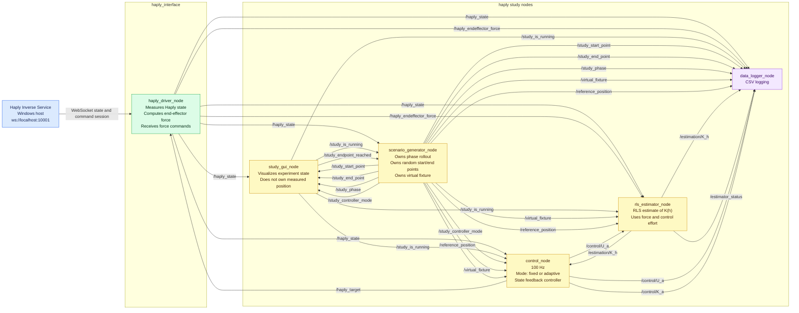

# Final Architecture - Haptic Adaptive Shared Control

This document is the final architecture reference for the Haply shared-control
study. It replaces the earlier review notes and consolidates the final ROS node
boundaries, topics, and fault-handling path.

## 1. Final Design Decisions

### GUI

- Runs at 100 Hz.
- Visualizes the measured cursor, start point, end point, current phase,
  controller mode, and Behavioral State legend.
- The Behavioral State legend remains part of the interface:
  - Red = Aggressive
  - Yellow = Normal
  - Green = Careful
- Does not own or relay measured user position. User position is measured by
  the Haply driver and published on `/haply_state`.
- Does not own phase rollout or the randomization of start/end points.
- Does not need start, pause, or reset buttons.
- Does not need to display coordinates.
- Publishes `/study_is_running` to Scenario Generator, Controller, Estimator,
  and Logger.
- Publishes `/study_endpoint_reached` when the user reaches the current stop
  endpoint.

### Scenario Generator

- Separate from the GUI and Controller.
- Owns experiment phase rollout.
- Owns random start/end point generation.
- Owns the virtual straight-line fixture between the current start and end
  points.
- Defines each phase's Behavioral State: aggressive, normal, or careful.
- Defines each phase's controller mode: adaptive or fixed.
- Publishes start/end points for GUI display and Logger.
- Publishes `/study_phase` to GUI and Logger.
- Publishes `/study_controller_mode` to GUI and Controller.
- Publishes `/virtual_fixture` and `/reference_position` to Controller,
  Estimator, and Logger.
- Waits for `/study_endpoint_reached` feedback before rolling out the next
  phase.

### Controller

- Runs at 100 Hz.
- One control node with a mode flag: `fixed` or `adaptive`.
- Fixed mode uses `alpha = 0.5`.
- Uses state feedback control. PID or MPC can be evaluated as implementation
  candidates, but the architecture has one Controller node.
- Adaptive mode updates `K(a)` based on estimated `K(h)`.
- Publishes `/control/U_a` to Estimator and Logger.
- Publishes `/control/K_a` to Logger.
- Publishes `/haply_target` to the Haply driver.

### Estimator

- Uses recursive least squares (RLS).
- Estimates human stiffness `K(h)` and human effort `u_h` from:

```text
u_h = K(h) * x
```

- Uses `/haply_endeffector_force`, computed inside `haply_driver_node.py` from
  torque-derived force.
- Publishes `/estimation/K_h` to Controller and Logger.
- Publishes `/estimator_status` to Logger.

### Haply Interface / Driver

- `haply_driver_node.py` remains the hardware measurement and command bridge.
- Computes end-effector force from available Haply torque/state data.
- Publishes `/haply_state`.
- Publishes `/haply_endeffector_force` to Estimator and Logger.
- Receives `/haply_target` from Controller.

### Data Logger

- Logs to CSV.
- Subscribes to all study, control, estimator, Haply state, force, fixture, and
  phase topics needed for offline analysis.

## 2. Final Mermaid Architecture Diagram



## 3. ROS Topics

| Topic | Type | Publisher | Subscribers | Purpose |
|---|---|---|---|---|
| `/haply_state` | `haply_msgs/HaplyState` | `haply_driver_node` | GUI, Scenario Generator, Controller, Estimator, Logger | Measured Haply position, velocity, orientation, and buttons. This is the source of user position. |
| `/haply_endeffector_force` | `geometry_msgs/Vector3` | `haply_driver_node` | Estimator, Logger | End-effector force computed in the driver from torque-derived force. |
| `/haply_target` | `haply_msgs/HaplyControl` | Controller | `haply_driver_node` | Force command sent to the Haply device. |
| `/study_is_running` | `std_msgs/Bool` | GUI | Scenario Generator, Controller, Estimator, Logger | Study run state. `true` means the current phase should actively run. |
| `/study_endpoint_reached` | `std_msgs/Bool` | GUI | Scenario Generator | Feedback that the user has reached the current stop endpoint, allowing phase rollout. |
| `/study_start_point` | `geometry_msgs/Point` | Scenario Generator | GUI, Logger | Current phase start point to display and log. |
| `/study_end_point` | `geometry_msgs/Point` | Scenario Generator | GUI, Logger | Current phase endpoint to display and log. |
| `/study_phase` | `std_msgs/String` | Scenario Generator | GUI, Logger | Behavioral State phase: `aggressive`, `normal`, or `careful`. |
| `/study_controller_mode` | `std_msgs/String` | Scenario Generator | GUI, Controller | Control condition for the current phase: `adaptive` or `fixed`. |
| `/virtual_fixture` | TBD; documented as straight-line segment from start to end | Scenario Generator | Controller, Estimator, Logger | Virtual straight-line fixture used as the reference path for control and performance analysis. Message type can be finalized later. |
| `/reference_position` | `geometry_msgs/Point` | Scenario Generator | Controller, Estimator, Logger | Current reference point on the virtual fixture. |
| `/estimation/K_h` | `std_msgs/Float64` | Estimator | Controller, Logger | Estimated human stiffness. |
| `/estimator_status` | `std_msgs/String` | Estimator | Logger | Estimator health and fault status, e.g. `ok`, `force_stale`, `saturated`, `reset`. |
| `/control/U_a` | `geometry_msgs/Vector3` | Controller | Estimator, Logger | Applied robot assistance/control force. |
| `/control/K_a` | `std_msgs/Float64` | Controller | Logger | Active controller gain used for the current phase. |

## 4. Fault Handling Path

### Haply state stale or disconnected

- Controller detects stale `/haply_state` and immediately publishes zero force
  on `/haply_target`.
- Estimator pauses RLS updates while Haply state is stale.
- GUI displays a disconnected/stale state.
- Logger records the stale/disconnected condition.

### End-effector force missing or stale

- Estimator publishes:

```text
estimator_status = "force_stale"
```

- Estimator freezes or resets the RLS update.
- Controller falls back to fixed mode until force data becomes valid again.
- Logger records the force fault.

### Estimator divergence

- Estimator clamps `K(h)` to the accepted operating range.
- If covariance or estimate quality diverges, Estimator resets to its prior.
- Estimator publishes:

```text
estimator_status = "saturated"
```

or:

```text
estimator_status = "reset"
```

- Logger records the event.

### User leaves workspace bounds

- Controller detects out-of-workspace `/haply_state.position`.
- Controller reduces assistance to safe low force or zero force.
- Logger records the workspace fault.

### Scenario timeout or endpoint not reached

- Scenario Generator tracks phase timeout.
- If `/study_endpoint_reached` is not received before timeout, Scenario
  Generator records a timeout and either repeats or advances the phase according
  to the experiment protocol.
- Logger records the timeout and phase decision.

### Logger failure

- Study can continue if Logger fails.
- GUI or Scenario Generator should expose logger status when available.
- Fault is not allowed to stop safety behavior in Controller or Driver.

## 5. Implementation Notes

- GUI and Controller both run at 100 Hz.
- The GUI interface continuously displays the Behavioral State legend:
  `Red = Aggressive`, `Yellow = Normal`, `Green = Careful`.
- The GUI displays start/end points but does not generate them.
- Scenario Generator owns randomization of start/end points.
- Scenario Generator owns the virtual fixture.
- Force calculation belongs in `haply_driver_node.py`.
- CSV is the final data logging format.
- PID and MPC remain candidate implementations for the state feedback
  controller, but the architecture has one Controller node with a fixed/adaptive
  mode flag.
