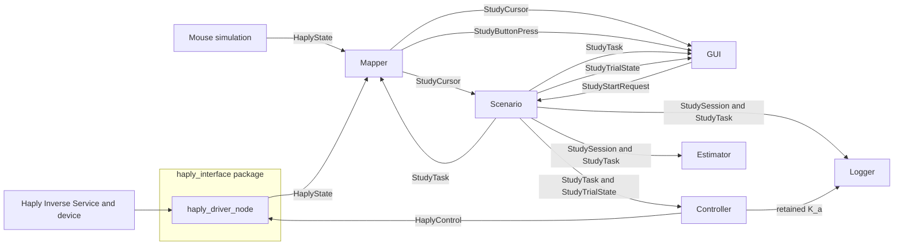

# Haply Study Architecture

This directory contains the ROS 2 packages for the shared-control study. The
protocol is task-identified: a session and trial ID travel with every task,
cursor, button press, start request, dwell update, and trial-state message.

## Node responsibilities

| Node | Responsibility |
| --- | --- |
| `haply_driver_node` | Bridges the Haply Inverse Service to raw `/haply_state` and `/haply_target` force commands. |
| `experiment_mapper` | Calibrates on the first Button-A rising edge, maps raw Haply or mouse input into task coordinates, and emits later ID-bearing button presses. |
| `scenario_generator` | Owns YAML task scheduling, trial IDs, start acceptance, dwell, completion, abort, timeout policy, and readiness gating. |
| `study_gui` | Shows the task and mapped cursor, sends validated start/abort requests, and never decides whether a trial is running. |
| `state_feedback_control_node` | Applies timestamped, bounded Cartesian force with independent goal and straight-line virtual-fixture components. |
| `mpc_control_node` | Runs the separately selected MPC implementation through the typed study lifecycle. |
| `estimator_node` | Estimates effective closed-loop interaction dynamics, retaining RLS learning within one identified session. |
| `data_logger_node` | Records session manifests, retry-aware attempt outcomes, task metadata, and sampled signals. |
| `study_analysis` | Validates deterministic Controller/Estimator behavior and produces descriptive CSV/PDF study reports. |

## Trial flow



The first press calibrates only. A later release-and-press starts a trial only
when the GUI has a current, valid cursor at the task start and Scenario accepts
the request. Input loss aborts the trial and Controller publishes zero force.

## Primary typed interfaces

| Topic | Type | Publisher | Purpose |
| --- | --- | --- | --- |
| `/study_task` | `haply_msgs/StudyTask` | Scenario | Atomic task start/end, phase, controller mode, session and trial IDs. |
| `/study_session` | `haply_msgs/StudySession` | Scenario | Retained schema, input/controller configuration, resolved seed, estimator policy, and complete ordered schedule. |
| `/study_cursor` | `haply_msgs/StudyCursor` | Mapper | Timestamped mapped cursor and task-specific validity. |
| `/study_button_pressed` | `haply_msgs/StudyButtonPress` | Mapper | Post-calibration, task-identified Button-A edge. |
| `/study_start_requested` | `haply_msgs/StudyStartRequest` | GUI | Request to start the active task. |
| `/study_abort_requested` | `haply_msgs/StudyAbortRequest` | GUI | Safe shutdown/abort request. |
| `/study_trial_state` | `haply_msgs/StudyTrialState` | Scenario | `READY`, `RUNNING`, `DWELL`, `COMPLETED`, `ABORTED`, or `SESSION_FINISHED`. |
| `/study_endpoint_dwell_progress` | `haply_msgs/StudyDwellProgress` | Scenario | Current endpoint dwell fraction. |
| `/study_system_ready` | `std_msgs/Bool` | Scenario | Whether required production components are healthy. |

`/experiment_cursor_position`, `/study_start_point`, `/study_end_point`,
`/study_controller_mode`, and related topics remain as a temporary metadata
compatibility layer. `StudyTrialState` is the sole production lifecycle
authority for MPC, State Feedback, Estimator, Logger, and GUI.

Retained configuration/state topics (`StudySession`, `StudyTask`, the latest
`StudyTrialState`, readiness, and `/control/K_a`) use reliable transient-local
QoS so late-starting nodes receive the current definition. High-rate cursor and
force streams use volatile, shallow QoS so stale samples are not replayed.
Button/start/abort messages are one-shot events and are also deliberately not
transient-local. The corresponding helper is named `_retained_state_qos` to
describe this boundary explicitly.

## Readiness and controller modes

Production hardware runs with `controller:=mpc` or
`controller:=state_feedback` wait for Controller, Estimator, and Logger
heartbeats before opening the participant window or accepting a start.
Estimator and Logger report ready only after they have received matching retained
`StudySession` and `StudyTask` definitions. Logger also requires its session
directory and manifest to be writable. Missing heartbeats block a start and abort
an active production trial. Mouse and GUI-only launches deliberately do not
require that gate.

`mpc` and `state_feedback` are controller families. `adaptive` and `fixed` are
task conditions selected by Scenario; the GUI displays both separately.
MPC and State Feedback use separate ROS executables. State Feedback output is a
Cartesian force in newtons; optional State Feedback docking is disabled by
default.

## Launches

```bash
# GUI, Mapper, and Scenario with mouse input
ros2 launch haply_study_gui study_gui_mouse.launch.py

# Mouse input with Controller, Estimator, and automatic Data Logger
ros2 launch haply_study_gui study_gui_mouse.launch.py \
  controller:=state_feedback

# Full state-feedback hardware stack (the default production controller)
ros2 launch haply_study_gui study_gui.launch.py participant_id:=P03

# Optional state-feedback docking (uses the documented safe defaults)
ros2 launch haply_study_gui study_gui.launch.py \
  participant_id:=P03 docking_enabled:=true

# Select the optional MPC family explicitly.
ros2 launch haply_study_gui study_gui.launch.py \
  participant_id:=P03 controller:=mpc

# mpc controller with docking
ros2 launch haply_study_gui study_gui.launch.py \
  participant_id:=P03 controller:=mpc docking_enabled:=true
```

### Controller visualization launches

After building and sourcing the workspace, launch the production mouse stack
with the additional controller-output visualization window:

```bash
ros2 launch control_node mouse_control_debug_launch.py
```

For the real device, first start the Haply Inverse Service and then launch the
production hardware stack, readiness gate, and visualization window:

```bash
ros2 launch control_node haply_control_debug_launch.py
```

Both wrappers default to `controller:=state_feedback` and DEBUG logging. MPC
can still be selected explicitly when required:

```bash
ros2 launch control_node mouse_control_debug_launch.py controller:=mpc
ros2 launch control_node haply_control_debug_launch.py controller:=mpc
```

These are visualization wrappers around the same production launches above;
they do not use separate Scenario, Mapper, GUI, Logger, Estimator, or controller
configuration.

Task paths are configured in `study_orchestration/config/default_tasks.yaml`.
Each YAML path has independent `start_point` and `end_point` values; it need
not be a closed chain.

## Configuration layers

Configuration is divided by ownership instead of repeated in launch files:

1. `study_orchestration/config/study_base.yaml` contains shared Scenario,
   Mapper, workspace, and GUI settings.
2. `study_mouse.yaml` or `study_haply.yaml` overlays source-specific mapping and
   rendering settings.
3. `control_node/config/state_feedback.yaml` or `mpc.yaml` contains only the
   selected controller family's parameters. The shared launch loads the matching
   file conditionally; State Feedback never receives MPC parameters and MPC
   never receives State Feedback parameters.
4. Launch arguments are reserved for run-time choices: controller family, log
   level, and the optional `docking_enabled` switch.

The two `control_node` debug launches are compatibility wrappers. They include
the corresponding production GUI launch unchanged and add only the controller
output visualizer plus debug logging, so they no longer define a second set of
study/controller defaults.

## Evaluation

Production logs are written under
`logs/<participant-id>_<YYYY-MM-DD_HH-MM-SSZ>/`. Assign pseudonymous
participant codes centrally so they remain unique when experiments run on
different computers. The production hardware launch therefore requires an
explicit code such as `participant_id:=P03`. The ordinary mouse launch defaults
to `P00`; the debug wrappers default to `DEBUG_MOUSE` and `DEBUG_HAPLY`, making
their output folders immediately recognizable without another argument. Each
run also contains the automatic UUID session ID in its reproducible manifest,
retry-aware trial CSVs, and `trial_attempts.csv`.

```bash
ros2 run study_analysis analyze_session \
  --input logs/<session-folder>

ros2 run study_analysis run_benchmark \
  --output analysis_results/benchmark \
  --seed 20260721
```

The session analyzer writes `trial_metrics.csv`, `condition_summary.csv`,
`data_quality.csv`, and `analysis_report.pdf`. The benchmark uses known
synthetic estimator coefficients and the production state-feedback force class;
participant logs alone are not estimator ground truth.
