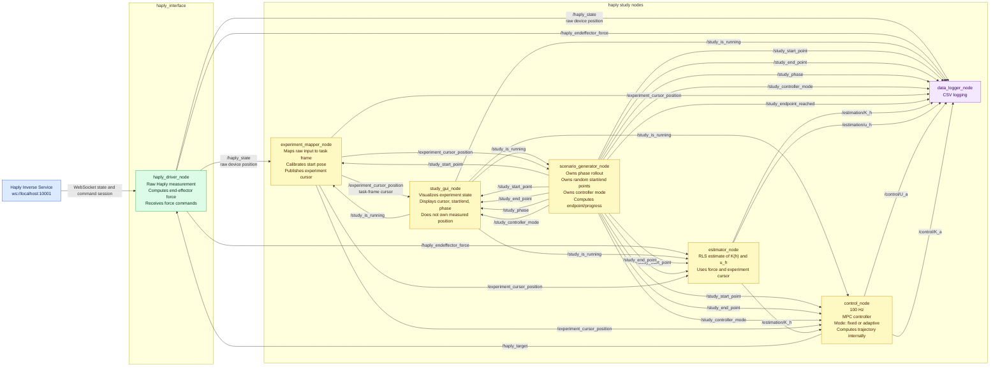

# Final Architecture - Haptic Adaptive Shared Control

This document is the final architecture reference for the Haply shared-control
study. It replaces the earlier review notes and consolidates the final ROS node
boundaries, topics, and fault-handling path.

## 1. Final Design Decisions

### GUI

- Runs at 100 Hz.
- Visualizes the experiment cursor, start point, end point, current phase,
  controller mode, and Behavioral State legend.
- The Behavioral State legend remains part of the interface:
  - Red = Aggressive
  - Yellow = Normal
  - Green = Careful
- Does not own or relay measured user position. The GUI displays the mapped
  experiment-frame cursor published on `/experiment_cursor_position`.
- Does not own phase rollout or the randomization of start/end points.
- Does not need start, pause, or reset buttons.
- Does not need to display coordinates.
- Publishes `/study_is_running` to Scenario Generator, Controller, Estimator,
  and Logger.

### Experiment Mapper

- Separate from the GUI, Scenario Generator, and Controller.
- Owns the mapping from raw input-device coordinates into experiment/task
  coordinates.
- Subscribes to raw Haply position on `/haply_state`.
- Subscribes to `/study_start_point` so the current raw Haply pose can be
  anchored to the current experiment start point.
- Captures the raw Haply pose at trial start and maps subsequent displacement
  into the experiment frame.
- Publishes `/experiment_cursor_position` to GUI, Scenario Generator,
  Controller, Estimator, and Logger.
- Keeps the architecture compatible with future mouse-input or simulated-input
  modes, because downstream nodes can use `/experiment_cursor_position`
  independent of the physical input device.

### Scenario Generator

- Separate from the GUI and Controller.
- Owns experiment phase rollout.
- Owns random start/end point generation.
- Owns the current task definition through the randomized start and end points.
- Defines each phase's Behavioral State: aggressive, normal, or careful.
- Defines each phase's controller mode: adaptive or fixed.
- Publishes start/end points to GUI, Experiment Mapper, Controller, Estimator,
  and Logger.
- Publishes `/study_phase` to GUI and Logger.
- Publishes `/study_controller_mode` to GUI, Controller, and Logger.
- Subscribes to `/experiment_cursor_position` to compute progress and endpoint
  reached.
- Waits until the current endpoint is reached before rolling out the next phase.

### Controller

- Runs at 100 Hz. All actions are event driven, thus this setting depends on the other topics to which it is subscribed to
- One control node with a mode flag: `fixed` or `adaptive`.
- Fixed mode uses `alpha = 0.5`.
- Is the MPC-based controller. It computes the trajectory and control action
  internally from `/study_start_point`, `/study_end_point`,
  `/experiment_cursor_position`, and `/estimation/K_h`.
- Adaptive mode updates `K(a)` based on estimated `K(h)`.
- Publishes `/control/U_a` to Logger as the applied-assistance/control-force
  diagnostic.
- Publishes `/control/K_a` to Logger.
- Publishes `/haply_target` to the Haply driver.
- Does not directly manipulate the GUI or Scenario Generator position. The
  control output affects the experiment cursor through the physical Haply
  device: `/haply_target` changes the force felt by the user, the user/device
  moves, `/haply_state` updates, and the mapper publishes the next
  `/experiment_cursor_position`.

### Estimator

- Uses recursive least squares (RLS).
- Estimates human stiffness `K(h)` and human effort `u_h` from:

```text
u_h = K(h) * x
```

- Uses `/experiment_cursor_position`, `/study_start_point`, and
  `/study_end_point` to compute the task-space displacement/error `x`.
- Uses `/haply_endeffector_force`, computed inside `haply_driver_node.py` from
  torque-derived force.
- Publishes `/estimation/K_h` to Controller and Logger.
- Publishes `/estimation/u_h` to Logger.

### Haply Interface / Driver

- `haply_driver_node.py` remains the hardware measurement and command bridge.
- Computes end-effector force from available Haply torque/state data.
- Publishes `/haply_state`, which is the raw Haply/device state and not
  necessarily in the GUI/task coordinate frame.
- Publishes `/haply_endeffector_force` to Estimator and Logger.
- Receives `/haply_target` from Controller.

### Data Logger

- Logs to CSV.
- Subscribes to all study, control, estimator, raw Haply state, mapped cursor,
  force, controller-mode, and phase topics needed for offline analysis.
- Logs both raw `/haply_state` and mapped `/experiment_cursor_position` so the
  coordinate mapping can be checked offline.

## 2. Final Mermaid Architecture Diagram



## 3. ROS Topics

| Topic | Type | Publisher | Subscribers | Purpose |
|---|---|---|---|---|
| `/haply_state` | `haply_msgs/HaplyState` | `haply_driver_node` | Experiment Mapper, Logger | Raw Haply/device position, velocity, orientation, and buttons. This is the hardware measurement source, but it is not necessarily in the GUI/task coordinate frame. |
| `/experiment_cursor_position` | `geometry_msgs/Point` | Experiment Mapper | GUI, Scenario Generator, Controller, Estimator, Logger | Mapped experiment-frame cursor position. This is the cursor position used by the study task, controller, estimator, GUI, and logger. |
| `/haply_endeffector_force` | `geometry_msgs/Vector3` | `haply_driver_node` | Estimator, Logger | End-effector force computed in the driver from torque-derived force. |
| `/haply_target` | `haply_msgs/HaplyControl` | Controller | `haply_driver_node` | Force command sent to the Haply device. |
| `/study_is_running` | `std_msgs/Bool` | GUI | Experiment Mapper, Scenario Generator, Controller, Estimator, Logger | Study run state. `true` means the current phase should actively run. |
| `/study_endpoint_reached` | `std_msgs/Bool` | Scenario Generator | Logger | Records that the mapped experiment cursor reached the current stop endpoint. |
| `/study_start_point` | `geometry_msgs/Point` | Scenario Generator | Experiment Mapper, GUI, Controller, Estimator, Logger | Current phase start point. The mapper uses it to anchor raw Haply position to the experiment frame; the Controller and Estimator use it as task definition; GUI displays it; Logger records it. |
| `/study_end_point` | `geometry_msgs/Point` | Scenario Generator | GUI, Controller, Estimator, Logger | Current phase endpoint used by MPC, Estimator, GUI, and Logger. |
| `/study_phase` | `std_msgs/String` | Scenario Generator | GUI, Logger | Behavioral State phase: `aggressive`, `normal`, or `careful`. |
| `/study_controller_mode` | `std_msgs/String` | Scenario Generator | GUI, Controller, Logger | Control condition for the current phase: `adaptive` or `fixed`. Logger records this for fixed/adaptive analysis. |
| `/estimation/K_h` | `std_msgs/Float64` | Estimator | Controller, Logger | Estimated human stiffness. |
| `/estimation/u_h` | `geometry_msgs/Vector3` | Estimator | Logger | Estimated human effort/control input in task space. |
| `/control/U_a` | `geometry_msgs/Vector3` | Controller | Logger | Applied robot assistance/control force, logged as a diagnostic only. |
| `/control/K_a` | `std_msgs/Float64` | Controller | Logger | Active controller gain used for the current phase. |

## 4. Fault Handling Path

### Haply state stale or disconnected

- Experiment Mapper detects stale `/haply_state` and marks
  `/experiment_cursor_position` stale.
- Controller detects stale `/experiment_cursor_position` and immediately
  publishes zero force on `/haply_target`.
- Estimator pauses RLS updates while Haply state or experiment cursor state is
  stale.
- GUI displays a disconnected/stale state.
- Logger records the stale/disconnected condition.

### User leaves workspace bounds

- Controller detects out-of-workspace `/experiment_cursor_position`.
- Controller reduces assistance to safe low force or zero force.
- Logger records the workspace fault.

### Scenario timeout or endpoint not reached

- Scenario Generator tracks phase timeout.
- If the endpoint is not reached before timeout, Scenario Generator records a
  timeout and either repeats or advances the phase according to the experiment
  protocol.
- Logger records the timeout and phase decision.

### Logger failure

- Study can continue if Logger fails.
- GUI or Scenario Generator should expose logger status when available.
- Fault is not allowed to stop safety behavior in Controller or Driver.

## 5. Implementation Notes

- GUI and Controller both run at 100 Hz.
- The GUI interface continuously displays the Behavioral State legend:
  `Red = Aggressive`, `Yellow = Normal`, `Green = Careful`.
- The GUI displays start/end points but does not generate them.
- Scenario Generator owns randomization of start/end points.
- Experiment Mapper converts raw `/haply_state` into
  `/experiment_cursor_position`.
- Scenario Generator publishes start/end points as task definition to the MPC
  Controller and Estimator.
- Controller computes the trajectory and task-space control action internally,
  then sends force to the Haply driver through `/haply_target`.
- Estimator publishes both `/estimation/K_h` and `/estimation/u_h`; the
  Controller consumes `/estimation/K_h` for adaptation and logs `/control/U_a`
  only as a diagnostic.
- Force calculation belongs in `haply_driver_node.py`.
- CSV is the final data logging format.
- The Controller is MPC-based and has one fixed/adaptive mode flag.
