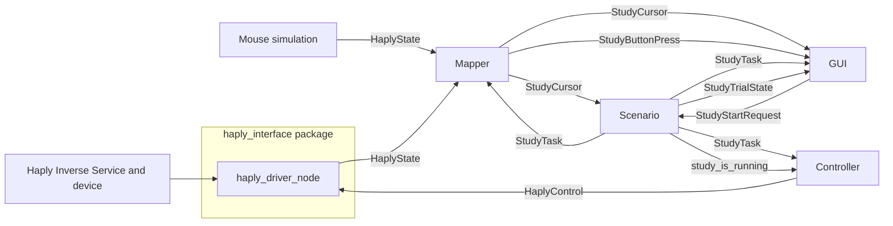

# Haply Study Architecture

This directory contains the ROS 2 packages for the shared-control study. The
protocol is task-identified: a session and trial ID travel with every task,
cursor, button press, start request, dwell update, and trial-state message.

## Node responsibilities

| Node | Responsibility |
| --- | --- |
| `haply_driver_node` | Bridges the Haply Inverse Service to raw `/haply_state` and `/haply_target` force commands. |
| `experiment_mapper` | Calibrates on the first Button-A rising edge, maps raw Haply or mouse input into task coordinates, and emits later ID-bearing button presses. |
| `scenario_generator` | Owns YAML task scheduling, trial IDs, start acceptance, dwell, completion, abort, timeout policy, and readiness gating. |
| `study_gui` | Shows the task and mapped cursor, sends validated start/abort requests, and never decides whether a trial is running. |
| `control_node` | Configures MPC or state-feedback control from atomic `StudyTask` messages and emits force commands only while Scenario has accepted a run. |
| `estimator_node` | Estimates participant dynamics for adaptive control. |
| `data_logger_node` | Records compatibility study, controller, estimator, raw-input, and cursor topics to CSV. |

## Trial flow



The first press calibrates only. A later release-and-press starts a trial only
when the GUI has a current, valid cursor at the task start and Scenario accepts
the request. Input loss aborts the trial and Controller publishes zero force.

## Primary typed interfaces

| Topic | Type | Publisher | Purpose |
| --- | --- | --- | --- |
| `/study_task` | `haply_msgs/StudyTask` | Scenario | Atomic task start/end, phase, controller mode, session and trial IDs. |
| `/study_cursor` | `haply_msgs/StudyCursor` | Mapper | Timestamped mapped cursor and task-specific validity. |
| `/study_button_pressed` | `haply_msgs/StudyButtonPress` | Mapper | Post-calibration, task-identified Button-A edge. |
| `/study_start_requested` | `haply_msgs/StudyStartRequest` | GUI | Request to start the active task. |
| `/study_abort_requested` | `haply_msgs/StudyAbortRequest` | GUI | Safe shutdown/abort request. |
| `/study_trial_state` | `haply_msgs/StudyTrialState` | Scenario | `READY`, `RUNNING`, `DWELL`, `COMPLETED`, `ABORTED`, or `SESSION_FINISHED`. |
| `/study_endpoint_dwell_progress` | `haply_msgs/StudyDwellProgress` | Scenario | Current endpoint dwell fraction. |
| `/study_system_ready` | `std_msgs/Bool` | Scenario | Whether required production components are healthy. |

`/experiment_cursor_position`, `/study_start_point`, `/study_end_point`,
`/study_controller_mode`, `/study_is_running`, and related topics remain for
Estimator and Logger compatibility. New GUI and Scenario behavior uses the
typed interfaces above.

> **Migration note:** Controller currently still uses `/study_is_running` as a
> compatibility run gate. It should eventually consume `StudyTrialState`
> directly: configure from `StudyTask`, enable force for `RUNNING` (and any
> chosen dwell behavior), and stop safely for `READY`, `COMPLETED`, `ABORTED`,
> and `SESSION_FINISHED`. That removes the remaining untyped lifecycle signal.

## Readiness and controller modes

Production hardware runs with `controller:=mpc` or
`controller:=state_feedback` wait for Controller, Estimator, and Logger
heartbeats before opening the participant window or accepting a start. Missing
heartbeats block a start and abort an active production trial. Mouse and
GUI-only launches deliberately do not require that gate.

`mpc` and `state_feedback` are controller families. `adaptive` and `fixed` are
task conditions selected by Scenario; the GUI displays both separately.

## Launches

```bash
# GUI, Mapper, and Scenario with mouse input
ros2 launch haply_study_gui study_gui_mouse.launch.py

# Mouse input with a controller and estimator
ros2 launch haply_study_gui study_gui_mouse.launch.py controller:=state_feedback

# Hardware GUI; controller defaults to none
ros2 launch haply_study_gui study_gui.launch.py

# Full MPC hardware stack: driver, Mapper, Scenario, MPC, Estimator, Logger, GUI
# Includes the production readiness gate.
ros2 launch haply_study_gui study_gui.launch.py controller:=mpc
```

Task paths are configured in `study_orchestration/config/default_tasks.yaml`.
Each YAML path has independent `start_point` and `end_point` values; it need
not be a closed chain.
