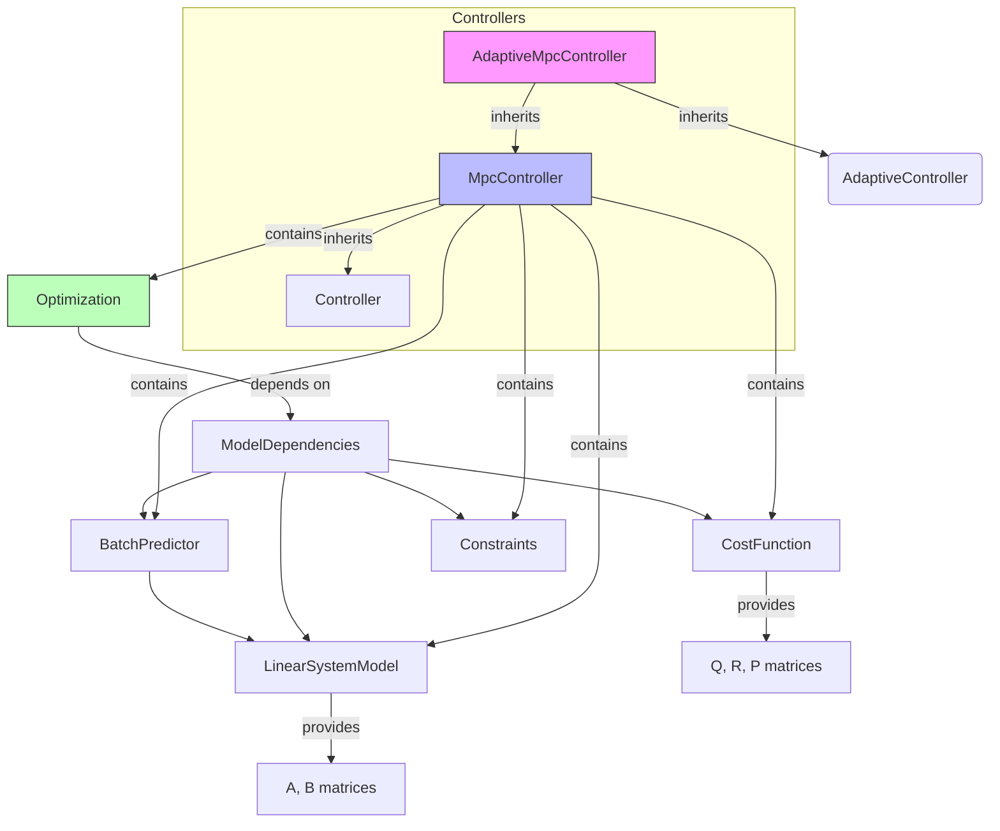

# MPC Controller Components

This document diagrams the relationships between the provided MPC-related files.

```mermaid
flowchart TD
  subgraph Controllers
    AC[AdaptiveMpcController]
    MC[MpcController]
    C[Controller]
  end
  AC -->|inherits| MC
  AC -->|inherits| ACBase(AdaptiveController)
  MC -->|inherits| C

  MC -->|contains| LSM[LinearSystemModel]
  MC -->|contains| BP[BatchPredictor]
  MC -->|contains| CF[CostFunction]
  MC -->|contains| CN[Constraints]
  MC -->|contains| OPT[Optimization]

  OPT -->|depends on| MD[ModelDependencies]
  MD --> LSM
  MD --> CN
  MD --> CF
  MD --> BP

  BP --> LSM
  CF -->|provides| QRP[Q, R, P matrices]
  LSM -->|provides| AB[A, B matrices]

  style AC fill:#f9f,stroke:#333,stroke-width:1px
  style MC fill:#bbf,stroke:#333,stroke-width:1px
  style OPT fill:#bfb,stroke:#333,stroke-width:1px
```
