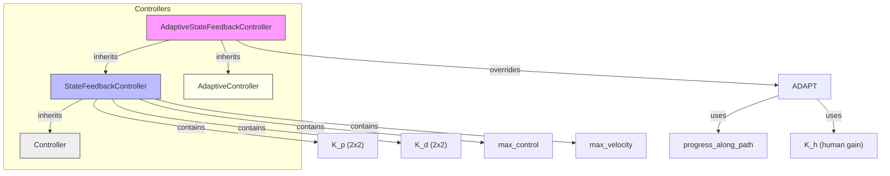

# State-Feedback Controller Components

Diagram showing relationships for the state-feedback controllers provided.

```mermaid
flowchart TD
  subgraph Controllers
    ASC[AdaptiveStateFeedbackController]
    SFC[StateFeedbackController]
    C[Controller]
    AC[AdaptiveController]
  end

  ASC -->|inherits| SFC
  ASC -->|inherits| AC
  SFC -->|inherits| C

  SFC -->|contains| KP["K_p (2x2)"]
  SFC -->|contains| KD["K_d (2x2)"]
  SFC -->|contains| MC["max_control"]
  SFC -->|contains| MV["max_velocity"]

  ASC -->|overrides| ADAPT
  ADAPT -->|uses| progress["progress_along_path"]
  ADAPT -->|uses| K_h["K_h (human gain)"]

  style ASC fill:#f9f,stroke:#333,stroke-width:1px
  style SFC fill:#bbf,stroke:#333,stroke-width:1px
  style C fill:#eee,stroke:#333,stroke-width:1px
  style AC fill:#ffe,stroke:#333,stroke-width:1px
```
