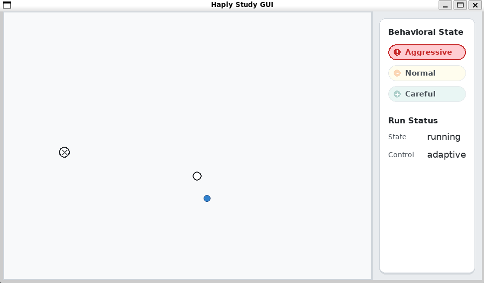

# Haply Study GUI

This package contains project-owned GUI code for the Haply shared-control user
study. The copied `haply_ros2_interface` packages remain responsible for the
hardware interface and Haply messages.

## Architecture

The GUI is a visual instruction and experiment feedback publisher:

- subscribes to `experiment_cursor_position` for live experiment cursor
  feedback
- receives mapped cursor feedback from `experiment_cursor_position`
- subscribes to `study_start_point`, `study_end_point`, `study_phase`, and
  `study_controller_mode` from the Scenario Generator
- publishes `study_is_running`
- renders the participant-facing Pygame window at 100 Hz by default
- supports `source=mouse` for testing and `source=haply` for hardware input
- publishes fake `haply_state` in mouse mode so the Experiment Mapper and
  Scenario Generator can be tested without hardware
- starts each trial only when VerseGrip Button A, or the left mouse button in
  mouse mode, is pressed while the mapped cursor is at the current start point
- does not publish `haply_target`
- does not own phase rollout, controller mode, or start/end point generation
- does not own endpoint detection or trial rollout
- does not implement fixed/adaptive controller logic
- does not estimate human parameters or log experiment data

This keeps the study GUI separate from the copied Haply driver code and leaves
force commands to the controller node.

## Haply Connection

The hardware launch starts `haply_interface/haply_driver_node`. That driver
connects to the Haply Inverse SDK Service at `ws://localhost:10001` and
publishes:

- `haply_state` (`haply_msgs/HaplyState`) for raw Haply/VerseGrip state
- `inverse3_state` (`haply_msgs/Inverse3State`) for Inverse3 position and
  velocity

The GUI receives the experiment cursor from `experiment_cursor_position`.
VerseGrip Button A (`haply_state.buttons.a`) is used only as the hardware
drawing/start input; the left mouse button is the mouse-mode equivalent.

## Run

Use `ros2 launch` for normal testing because the GUI needs other ROS nodes to
publish scenario or hardware data. Use `ros2 run` only when you intentionally
want to start one executable by itself.

### Testing

| Purpose | Command |
| --- | --- |
| Mouse GUI with Mapper and Scenario Generator | `ros2 launch haply_study_gui study_gui_mouse.launch.py` |
| GUI only with mouse source | `ros2 run haply_study_gui study_gui --ros-args -p source:=mouse` |
| Self-contained `/haply_state` smoke test | `ros2 run haply_study_gui test_haply_state_topic --fake` |

### Hardware

Use the hardware launch only after the Haply Inverse SDK Service is running
and reachable on port `10001`. The ROS driver connects to it as a WebSocket
server at `ws://localhost:10001`; this is not a normal web page, so opening
`http://localhost:10001` in a browser may not show anything useful.

The supported hardware path is WSL-owned USB plus the Linux standalone Haply
Inverse Service. After `usbipd attach --wsl`, Windows no longer owns the device,
so Windows Haply Hub or Windows Inverse Service cannot see it. Start the Linux
service in WSL before launching ROS:

```bash
sudo systemctl start haply-inverse-service.service
```

| Purpose | Command |
| --- | --- |
| Haply GUI with Mapper and Scenario Generator | `ros2 launch haply_study_gui study_gui.launch.py` |
| Haply GUI with Controller | `ros2 launch haply_study_gui study_gui.launch.py use_controller:=true` |
| Haply GUI with Estimator | `ros2 launch haply_study_gui study_gui.launch.py use_estimator:=true` |
| Mouse GUI with Controller and Estimator | `ros2 launch haply_study_gui study_gui_mouse.launch.py use_controller:=true use_estimator:=true` |
| Mouse GUI with custom path YAML | `ros2 launch haply_study_gui study_gui_mouse.launch.py task_file:=/path/to/paths.yaml` |
| Mouse GUI with adaptive and fixed blocks | `ros2 launch haply_study_gui study_gui_mouse.launch.py controller_modes:=adaptive,fixed` |
| Haply GUI test launch | `ros2 launch haply_study_gui study_gui_haply_test.launch.py` |
| GUI only, expecting an existing `/haply_state` publisher | `ros2 run haply_study_gui study_gui --ros-args -p source:=haply` |
| Check live `/haply_state` messages | `ros2 run haply_study_gui test_haply_state_topic` |

The mouse launch starts `study_gui`, `experiment_mapper`, and
`scenario_generator`. It can also start `control_node` and `estimator_node` with
`use_controller:=true` and `use_estimator:=true`. The GUI publishes fake
`/haply_state`, the mapper publishes `/experiment_cursor_position`, and the
Scenario Generator detects endpoint completion from the mapped cursor.

The hardware launch starts `study_gui`, `haply_driver_node`,
`experiment_mapper`, and `scenario_generator`. The default path geometry is
loaded from the `study_orchestration` YAML config, but it still needs to be
verified on the physical Haply workspace before subject testing.

## Interface



The left box is the drawing workspace. The right panel shows the Behavioral
State legend and run status. In mouse mode, move the mouse inside the workspace
to move the blue cursor through the mapper. Press and hold the left mouse
button, or VerseGrip Button A in hardware mode, at the start point to begin a
trial. Releasing and pressing again during the same trial continues the existing
drawn path. The Scenario Generator rolls out the next phase one second after
the mapped cursor reaches the current endpoint.

The participant-facing GUI does not show start/pause/reset buttons or
coordinate text. Keyboard shortcuts remain available for test runs: `S` sets
`study_is_running=True`, `Space` toggles it, and `Esc`/`Q` closes the window.
